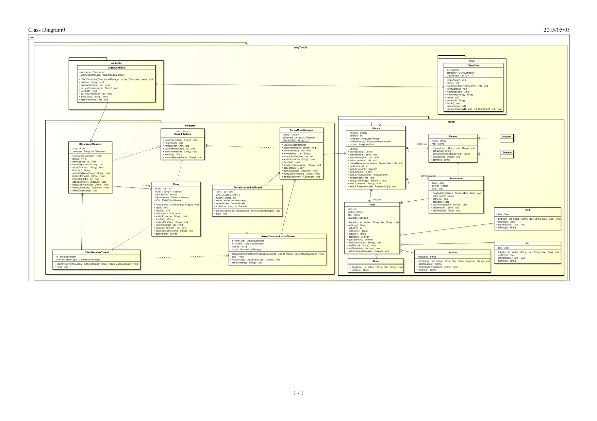
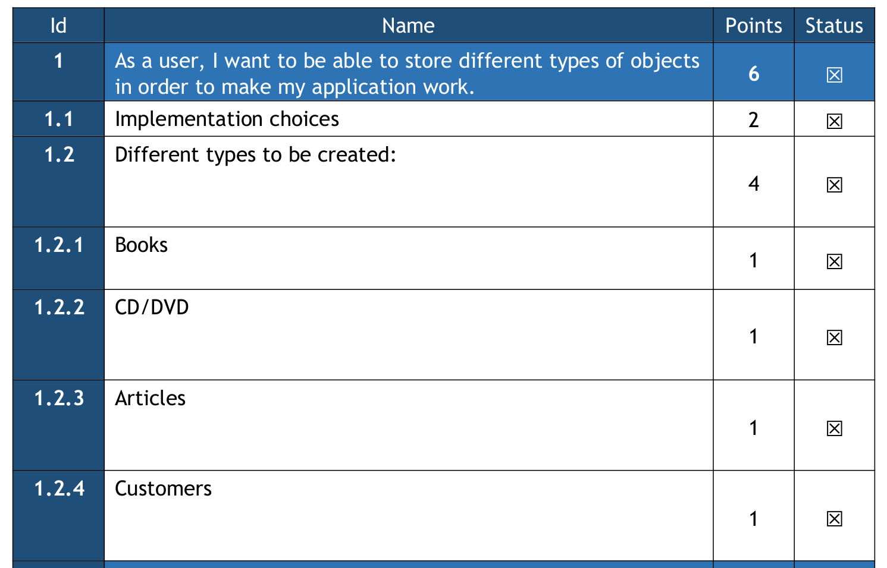
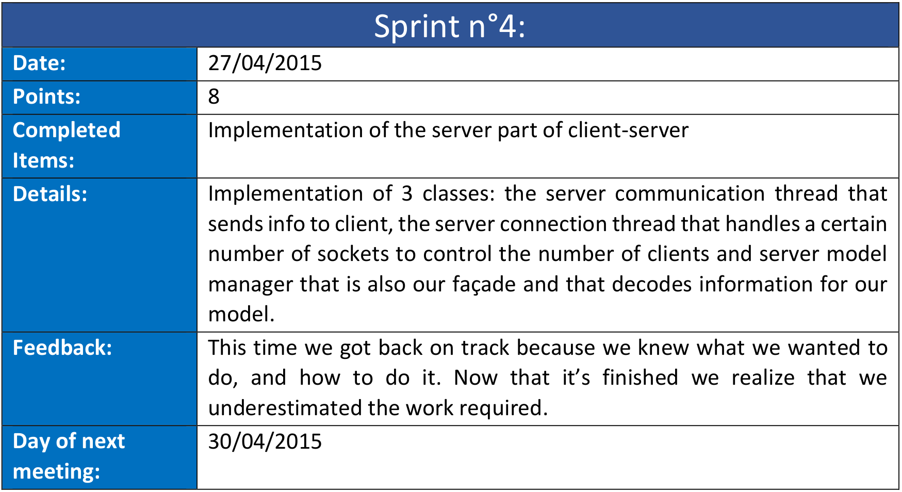
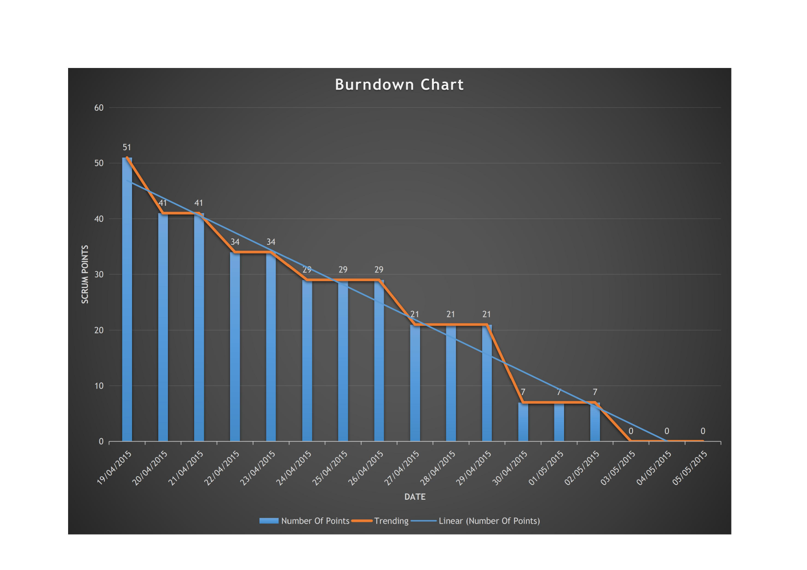

# fairy-tale-library

In this project, we developed a virtual library in Java using *Software Engineering techniques* in cunjunction with
*Agile Development*.

The following sections describe how we used these tools.

**Keywords:** UML ; Design Patterns ; Java ; Agile development ; SCRUM

**Authors:**
* **Andreas Guillot** - [Github](https://github.com/a-guillot)
* **Alvaro Mompo Camarasa** - [Linkedin](https://www.linkedin.com/in/%C3%A1lvaro-momp%C3%B3-camarasa-b45742171/)

## Software Engineering

### UML diagram

This image describes our architecture.
Each class (rectangles) are contained into packages (folders).

Solid arrows are for **associations**.
They symbolize the fact that the class at the source of the arrow uses an object of the type of the destination of the arrow.
A simple example in our architecture is that the Library (capitalized since it is a class name) contains lists of Persons, Items, and Reservations.

Dotted arrows are for **dependencies**.
Indicates that the source depends on the destination of the arrow.
In our architecture, the elements of the proxy have dependencies.
This is due to the fact that some common network information (e.g., IP address) are shared by multiple classes.

### Design Patterns

Design patterns are general solutions to a well-known problem.
In the following sections, we describe four commonly-uses patterns.

#### Model View Controller

The **Model View Controller** (MVC) design patterns enforce a true separation between the different layers of the architecture:

* *Model*: describes the inner-workings of the application, with its data, and logic. In our library, this refers to objects suck as books
* *View*: changes the data from the model into different visual representations. In the library, it refers to the view through which the clients of the library search, book, and return items.
* *Controller*: manages the interactions between View and Model. Every operation in the application go through the Controller to ensure that they respect its logic.

MVC enhances flexibility, as every information that the client wants to send to the model has to migrate through the controller, which adds an additional level of security.
The separation also allows to maintain the code very easily: changing something will only require to change a few classes, whereas if you don’t use MVC you might have to change a lot of them.
For example, if you want to change the view from a console to a GUI it won’t affect the other parts.
The separation also grants the possibility of reusing the code really easily, since every functionality is divided into multiple classes.

#### Singleton

The singleton Design Pattern makes sure that an object has one and only one instance.
It’s very useful if you want to keep your data stored in the same place, or if you want to have a better control on it.
In our case, the Library class was perfect because it’s where every information is: every client, item and reservation is stored in this class, which ensures that there is only one.

#### Façade

We chose to use the façade Design Pattern because it provided a simple way to access the model.
This way, our façade provided every functionality that the user needed, but without showing him information such as the model structure, or the client-server application.
That’s why our class ServerModelManager is perfect: by using the library, it provides a simplified interface of our underlying system.

#### Observer

The purpose of the observer is to create a collection of classes that will be aware when another one is modified.
That way, every change will be notified to the subclasses.
In our application, we have two different implementations of the Observer: one on the server, and one on the client.
The overall purpose is to notify our users that an event happened, such as the addition of an item to the library, the reservation of an item, but also when a reservation is about to end.
In the server, the ServerModelManager will notify its changes to the clients with the help of the ServerCommunicationthread, one for each client.
This thread will then send this information to the client, and the ClientModelManager will notify directly the user in the ServerView.

#### Proxy

We use the Proxy design pattern to handle connections between the library (the model), and its users (the views).
Using a generic proxy increases flexibility and security since all connections are going to go through the Proxy.
Additionally, we use threads to handle connections from multiple users to one server.

## Agile development with SCRUM

This project was done using SCRUM agile development methods.
This section is going to be divided into the following sections:
* Feature Specification
* Cutting the work into manageable chunks
* Measuring progress throughout development

### Feature Specification

In this section, we look at how we identified the features of our application, and how we divided them into categories and assigned different levels of priority using points.
All of this information is summarized into the **product backlog**.

In the context of the library, the first and most intuitive section was to enumerate the list of items that we wanted to provide in our library.

### Cutting the work into manageable chunks

We then divided the work into several **sprints**, which are development sessions (variable in time).
These sections are organized as follows.
First, the team discusses which items from the product backlog are going to worked on during this session.
Then, after the work is done, the team puts together a document that describes the completed items, and a general feedback of the sprint.
An example of this can be seen above.

### Measuring progress throughout development

The **burndown chart** is the tool used by SCRUM-users to identify their progress in the completion of the items of the product backlog.

The orange line indicates the actual progress of the team.
This line is put against the linear expectation of how fast the team should progress.
For example, a project with 50 points to complete in 10 days should expect to complete about 5 points per day.
Here, we use the remaining number of points to identify if we were ahead, or behind for the development.
